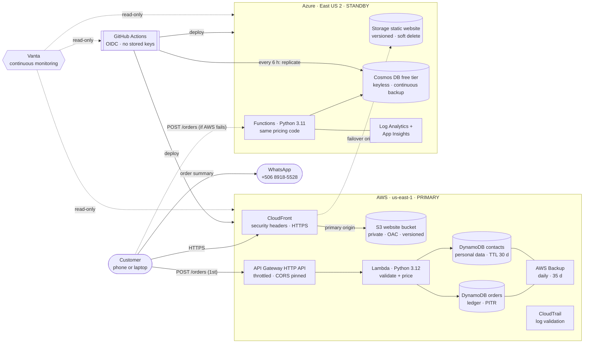
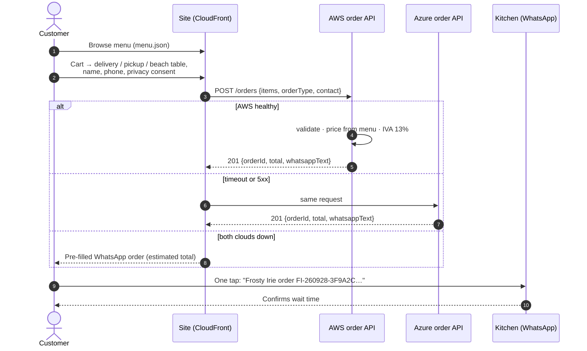
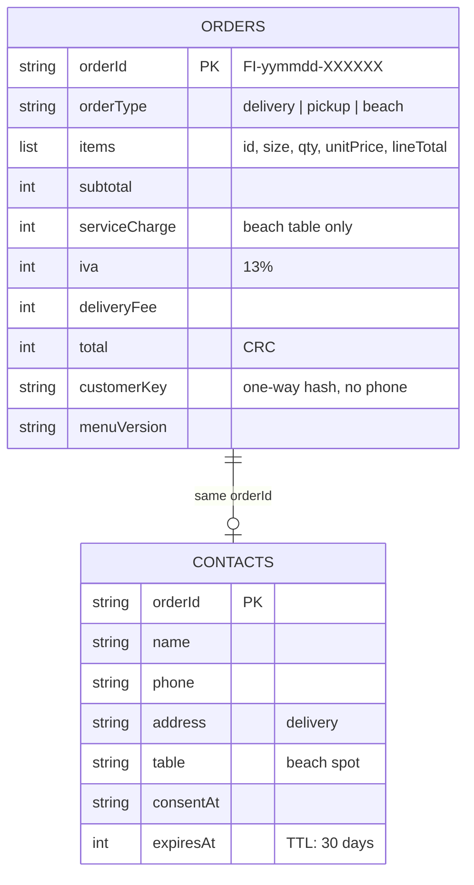
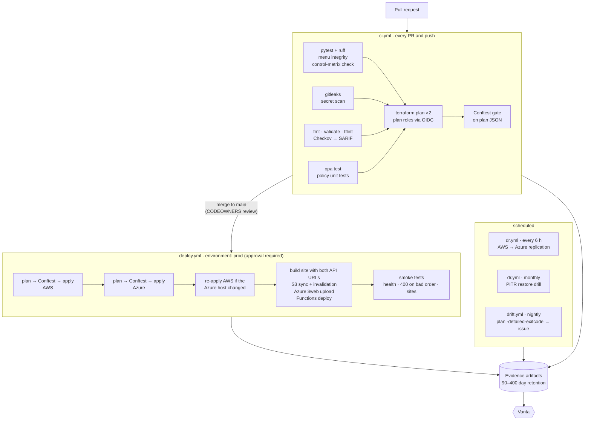
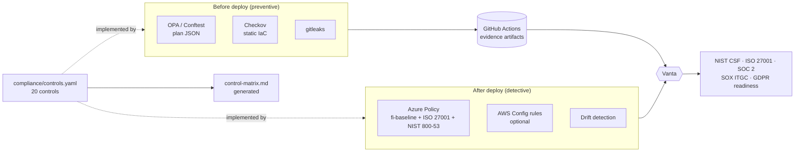
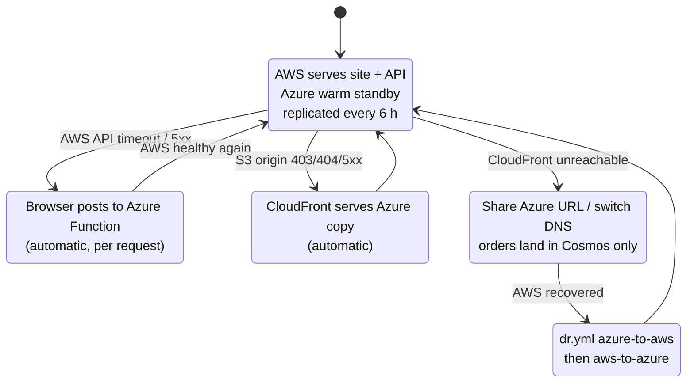

# Frosty Irie · Cloud Ordering Platform

**Cool Drinks & Irie People** — online ordering for Frosty Irie, beachfront in Puerto Viejo, Costa Rica.

Customers order pizza, tropical cocktails, cold beer and Caribbean eats from the same menu served at the bar, and choose **home delivery**, **pickup** or **delivery to their beach table**. The platform runs on **AWS (primary)** with a **warm standby on Azure** for backup and restore, is built entirely with **Terraform**, ships through **GitHub Actions**, and is continuously checked against **NIST CSF 2.0, ISO 27001:2022, SOC 2, SOX ITGC and GDPR** with policy-as-code and **Vanta**.

> **Status:** ready for first deployment. `app/menu/menu.json` is a draft consolidated from the two earlier website versions. Confirm every price against the printed menu before go-live (see [Updating the menu](#updating-the-menu)).

---

## Contents

1. [Architecture](#architecture)
2. [How an order flows](#how-an-order-flows)
3. [Repository layout](#repository-layout)
4. [Delivery pipeline](#delivery-pipeline)
5. [Compliance as code](#compliance-as-code)
6. [Backup, restore and failover](#backup-restore-and-failover)
7. [Free-tier budget](#free-tier-budget)
8. [Getting started](#getting-started)
9. [Working in VS Code](#working-in-vs-code)
10. [Updating the menu](#updating-the-menu)
11. [Known limits and next steps](#known-limits-and-next-steps)

---

## Architecture



**Design decisions**

| Decision | Why |
|---|---|
| Static site + serverless API | Nothing to patch, scales to zero, fits the always-free tiers |
| Same `pricing.py` in both clouds | An order priced in Azure is byte-for-byte the same as in AWS; one set of unit tests covers both |
| Prices only on the server | The browser sends item IDs and quantities; prices, happy hour, 10% service and 13% IVA come from `menu.json` on the server (processing integrity, SOX) |
| Orders and contacts in separate tables | The order ledger is kept for accounting; name, phone and address expire after 30 days (GDPR storage limitation) |
| Failover in three layers | Browser retries the Azure API → CloudFront serves the Azure site → WhatsApp as a last resort. No DNS change is needed for the common failures |
| Keyless everywhere | GitHub OIDC to both clouds, managed identity to Cosmos DB, Cosmos key auth disabled |

---

## How an order flows



**Data model**



---

## Repository layout

```
frosty-irie-cloud/
├── app/
│   ├── menu/menu.json            ← single source of truth for items and prices
│   ├── web/                      ← static site (HTML/CSS/JS, strict CSP, no framework)
│   └── api/
│       ├── common/pricing.py     ← validation + pricing shared by both clouds
│       ├── aws/handler.py        ← Lambda entry point
│       └── azure/function_app.py ← Azure Functions entry point
├── infra/
│   ├── bootstrap/aws/            ← state bucket, CloudTrail, GitHub OIDC roles, Vanta role, AWS Config
│   ├── bootstrap/azure/          ← state storage, GitHub federated identities, Azure Policy
│   ├── aws/                      ← primary workload stack
│   └── azure/                    ← standby workload stack
├── policies/
│   ├── opa/                      ← Conftest rules on Terraform plans (+ unit tests)
│   ├── azure/                    ← Azure Policy definitions (JSON)
│   └── aws/config-rules.json     ← AWS Config managed rules
├── compliance/
│   ├── controls.yaml             ← 20 controls mapped to NIST / ISO / SOC 2 / SOX / GDPR
│   ├── control-matrix.md         ← generated from controls.yaml (CI checks it)
│   ├── exceptions.md             ← risk-accepted exceptions register
│   └── vanta/README.md           ← connecting AWS, Azure and GitHub to Vanta
├── scripts/                      ← build, plan+policy gate, deploy, DR sync, restore drill
├── docs/runbooks/disaster-recovery.md
├── tests/                        ← pytest (pricing, handler with moto)
├── .github/workflows/            ← ci · deploy · dr · drift
└── .vscode/                      ← recommended extensions and one-click tasks
```

---

## Delivery pipeline



**Workflows**

| Workflow | Trigger | What it proves |
|---|---|---|
| `ci.yml` | PR, push to `main` | Code, IaC and policies are correct before anyone reviews |
| `deploy.yml` | CI succeeded on `main` + approval on `prod` | Only reviewed, policy-compliant plans reach production |
| `dr.yml` | Every 6 h, monthly, or manual (`aws-to-azure`, `azure-to-aws`, `restore-drill`) | The standby is current and backups actually restore |
| `drift.yml` | Nightly | Nobody changed production outside Git |

---

## Compliance as code



| Layer | Where | Examples |
|---|---|---|
| Preventive, pre-deploy | `policies/opa/*.rego` (15 unit tests) | Public buckets, missing PITR, personal data without TTL, Cosmos key auth, wildcard IAM, HTTP at the edge, missing Vanta tags, non-consumption plans |
| Static analysis | `.checkov.yaml` | CIS/NIST-mapped checks; every skip maps to an entry in `compliance/exceptions.md` |
| Runtime, Azure | `policies/azure/*.json` → `fi-baseline` initiative | Deny insecure storage, require HTTPS, deny Cosmos local auth, allowed locations, consumption plans only |
| Runtime, AWS | `policies/aws/config-rules.json` | 18 AWS managed Config rules, each tagged with the controls it evidences |
| Continuous monitoring | Vanta | Reads AWS, Azure and GitHub directly; resources self-describe through `Vanta*` tags |

The full control-to-framework mapping is in [`compliance/control-matrix.md`](compliance/control-matrix.md). How to wire Vanta is in [`compliance/vanta/README.md`](compliance/vanta/README.md).

---

## Backup, restore and failover



| Layer | AWS (primary) | Azure (standby) |
|---|---|---|
| Point-in-time | DynamoDB PITR, 35 days | Cosmos DB continuous backup, 7 days |
| Scheduled | AWS Backup daily, kept 35 days | Cross-cloud replica refreshed every 6 h |
| Static content | S3 versioning (30 days of old versions) | Blob versioning + 7-day soft delete |
| Tested | Monthly automated restore drill with measured RTO | Quarterly manual drill (runbook) |
| Targets | RPO ≤ 5 min in-cloud · ≤ 6 h cross-cloud · RTO ≤ 1 h | |

Step-by-step procedures: [`docs/runbooks/disaster-recovery.md`](docs/runbooks/disaster-recovery.md).

---

## Free-tier budget

| Service | Free allowance used | Notes |
|---|---|---|
| CloudFront | Always free: 1 TB out, 10 M requests / month | |
| Lambda | Always free: 1 M requests, 400k GB-s / month | |
| DynamoDB | Always free: 25 GB, 25 RCU + 25 WCU | 2 tables × 5/5 provisioned |
| API Gateway HTTP API | 1 M calls / month in the first 12 months | ~$1 per million afterwards |
| S3, CloudWatch, SNS, Budgets | Free-tier allowances | Budget alert at $5 |
| AWS Backup, PITR | Not free, cents / month at this size | Disable with `enable_backup_plan = false` |
| AWS Config | Not free (~$1–3 / month) | Off by default: `enable_aws_config` |
| Azure Functions (Consumption) | Always free: 1 M executions, 400k GB-s / month | |
| Cosmos DB free tier | 1,000 RU/s + 25 GB, one account per subscription | Database uses 400 RU/s shared |
| Azure Storage, Log Analytics | Small; Log Analytics capped at 0.15 GB/day | Budget alert at $5 |
| Azure Policy, Defender CSPM foundational | Free | |

Free-tier terms changed for new AWS accounts in 2025 (credit-based free plan) and differ for Azure free accounts. Check both consoles for what applies to your accounts. The budgets in both clouds email you before anything costs real money.

---

## Getting started

### Prerequisites

- AWS account (admin for the one-time bootstrap) and Azure subscription (Owner, plus Application Developer in Entra ID)
- GitHub repository with Actions enabled. Branch protection and required deployment reviewers are free on public repositories; on a private repository they need a paid GitHub plan (Pro or Team)
- Terraform ≥ 1.10, Python 3.12, Azure CLI, AWS CLI, OPA, Conftest; optionally Checkov, tflint and pre-commit
- VS Code with the recommended extensions (prompted on open)

### 1. Bootstrap AWS (once, from your machine)

```bash
cd infra/bootstrap/aws
terraform init
terraform apply -var owner_email=you@example.com -var github_repository=OWNER/frosty-irie-cloud
# Optional: add -var vanta_account_id=... -var vanta_external_id=... (from Vanta → Integrations → AWS)
# Optional: -var enable_aws_config=true
```

> **GitHub OIDC subject format.** Repositories created or renamed on github.com after 15 July 2026 send an OIDC `sub` claim with immutable IDs, for example `repo:OWNER@12345/frosty-irie-cloud@67890:ref:refs/heads/main`. For those, also pass `-var github_oidc_subject=OWNER@12345/frosty-irie-cloud@67890` to **both** bootstrap stacks. The IDs are in the first `AADSTS700213` error, or from `gh api repos/OWNER/frosty-irie-cloud --jq '"\(.owner.id) \(.id)"'`. The trust then pins to IDs that a re-created repository with the same name cannot reuse.

Outputs: `state_bucket`, `gh_plan_role_arn`, `gh_deploy_role_arn`, `vanta_role_arn`.

### 2. Bootstrap Azure (once)

```bash
az login
export ARM_SUBSCRIPTION_ID=$(az account show --query id -o tsv)
cd infra/bootstrap/azure
terraform init
terraform apply -var owner_email=you@example.com -var github_repository=OWNER/frosty-irie-cloud
```

Outputs: `state_storage_account`, `azure_tenant_id`, `azure_subscription_id`, `gh_plan_client_id`, `gh_deploy_client_id`, `github_sp_object_id`. This also creates and assigns the **Frosty Irie security baseline** Azure Policy initiative plus the built-in ISO 27001 and NIST SP 800-53 Rev.5 audit initiatives.

After both applies, uncomment the `backend` block in each bootstrap stack and run `terraform init -migrate-state` so bootstrap state is also remote.

### 3. Configure GitHub

**Settings → Environments → New environment `prod`:** add yourself (and ideally a second person) as required reviewers and enable "Prevent self-review".

**Settings → Branches → protect `main`:** require a PR, CODEOWNERS review, and these status checks: `App tests + lint`, `Secret scan`, `IaC static analysis`, `Policy-as-code unit tests`, `Plan + Conftest (aws)`, `Plan + Conftest (azure)`.

**Settings → Secrets and variables → Actions → Variables** (these are identifiers, not secrets; no cloud keys are stored anywhere):

| Variable | Value from |
|---|---|
| `OWNER_EMAIL` | your email |
| `TF_STATE_BUCKET` | AWS bootstrap `state_bucket` |
| `AWS_PLAN_ROLE_ARN` / `AWS_DEPLOY_ROLE_ARN` | AWS bootstrap outputs |
| `AZ_STATE_ACCOUNT` | Azure bootstrap `state_storage_account` |
| `AZURE_TENANT_ID` / `AZURE_SUBSCRIPTION_ID` | Azure bootstrap outputs |
| `AZURE_PLAN_CLIENT_ID` / `AZURE_DEPLOY_CLIENT_ID` | Azure bootstrap outputs |
| `AZURE_DEPLOYER_OBJECT_ID` | Azure bootstrap `github_sp_object_id` |
| `STANDBY_WEB_HOST` | after the first deploy: Azure `website_host` (used by PR plans and drift) |
| `PRIMARY_WEB_ORIGIN` | after the first deploy: AWS `website_url` |
| `COSMOS_ENDPOINT` | after the first deploy: Azure `cosmos_endpoint` (used by `dr.yml`) |

Replace `@OWNER` in `.github/CODEOWNERS` with your GitHub handle.

### 4. First deployment

Push to `main` (or run **Deploy** manually). The deploy script applies AWS, then Azure, then re-applies AWS once so CloudFront learns the Azure failover origin. After it finishes, set the three "after the first deploy" variables above. The job summary shows both site URLs.

### 5. Connect Vanta

Follow [`compliance/vanta/README.md`](compliance/vanta/README.md): AWS role, Azure Reader, GitHub App, then map controls `FI-01`…`FI-20`.

---

## Working in VS Code

Open the folder and accept the recommended extensions. Everything runs from **Terminal → Run Task…**:

| Task | Does |
|---|---|
| Serve site on http://localhost:8080 | Builds `dist/web` and serves it; without APIs configured, checkout falls back to WhatsApp |
| Unit tests | `pytest` (pricing, validation, Lambda handler against mocked DynamoDB) |
| Policy tests (OPA) | Runs the 15 Rego unit tests |
| Terraform fmt + validate (all stacks) | Same as CI |
| Checkov scan | Same config as CI |
| Plan + policy check: AWS / Azure | Local plan with Conftest gate (needs `backend.hcl` and `terraform.tfvars` from the `.example` files) |
| Deploy infra (both clouds) | The same converging script CI uses (needs `OWNER_EMAIL` exported) |

`make help` lists the same commands for the terminal. `pre-commit install` runs format, lint, secret and policy checks before each commit.

---

## Updating the menu

1. Edit `app/menu/menu.json`. Prices are integers in colones (CRC); item `id`s must stay stable once orders reference them.
2. Bump `version` (for example `2026.10.1`). It is stored on every order, so historical orders stay explainable.
3. Open a PR and tick "Menu / prices confirmed against the printed menu".
4. CI checks prices are positive integers and runs the pricing tests; the deploy updates the site and both APIs together.

Pricing rules in `menu.json → pricing`: IVA 13% on everything, 10% service charge on beach-table orders only, ₡1,500 delivery fee, and happy hour 16:00–18:00 (Costa Rica time) setting cocktails to ₡5,000. Change them there, not in code.

---

## Known limits and next steps

- **Menu prices are a draft.** Drinks and eats came from the USD demo site and were converted at about ₡520/USD, rounded to ₡500. Hours use the Pizza Corner draft (11:00–22:00).
- **No online payment yet.** Orders are confirmed and paid on WhatsApp or at the bar. Adding card payments would bring PCI DSS into scope; SINPE Móvil confirmation is a lighter first step.
- **Custom domain.** When `frostyirie.cr` is ready, add an ACM certificate and CloudFront aliases, and close exception EXC-006.
- **Azure Linux Consumption plan.** Microsoft is steering new Functions apps to Flex Consumption; the policy already allows `FC1` for that migration.
- **Kitchen view.** A small authenticated order board (Cognito + a read endpoint) would let staff see orders without WhatsApp.
- **Scheduled DR runs are switched off.** `dr.yml` runs in the `prod` environment, so a schedule would wait for a manual approval every 6 hours. Run it by hand until a separate least-privilege `ops` identity is added for unattended runs; the 6-hour cross-cloud RPO only holds once that schedule is back on.
- **Single operator.** With one person on the project, pull requests cannot get an independent approval (EXC-010). The `prod` environment approval and the automated gates are the compensating controls.
- **Terraform was validated but never applied from here.** All four stacks pass `validate`, Checkov is clean, and the AWS plan passes every Conftest rule. The first real apply may still surface account-specific issues (service quotas, Cosmos free-tier already used in the subscription, region availability).
